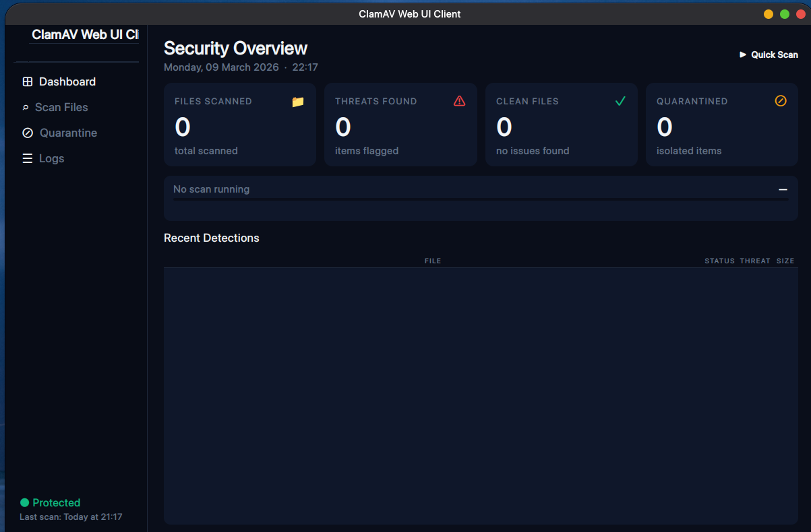
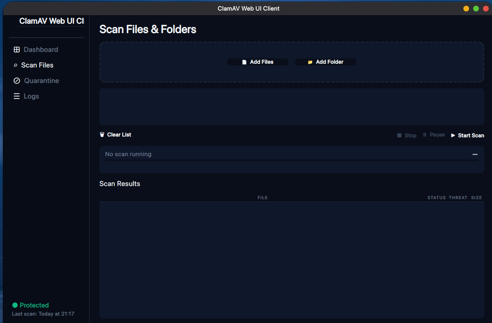
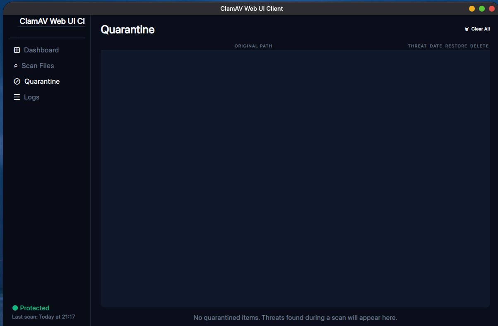
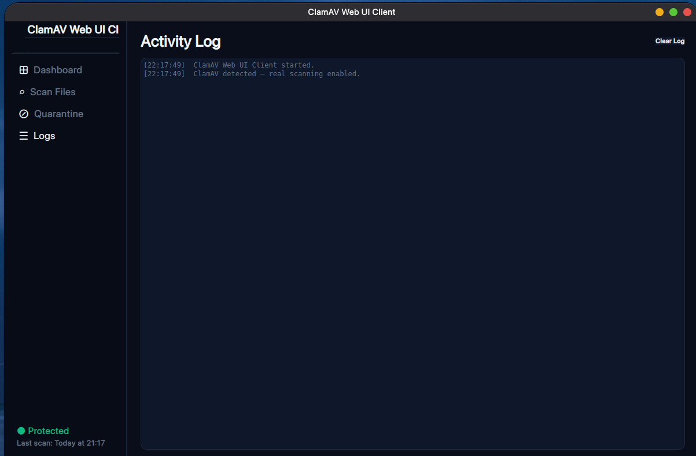

<div align="center">


# 🛡 ClamAV Dashboard

**antivirus dashboard built on ClamAV**  
*Real quarantine. Real protection. Clean UI.*

<br/>

[](https://python.org)
[](https://riverbankcomputing.com/software/pyqt/)
[](https://www.clamav.net/)
[](LICENSE)
[](https://linux.org)

<br/>

</div>

---

## ✦ Overview

ShieldScan is a sleek, dark-themed antivirus dashboard that wraps ClamAV with a professional PyQt5 interface. It gives you real-time scanning, genuine file quarantine with permission lockdown, and full threat management — all from a single clean window.

No bloat. No ads. No cloud. Just your machine, ClamAV, and a UI that doesn't look like it was made in 2003.

For windows and Mac os it will be added in the future.

---

## ✦ Features

| | Feature | Description |
|---|---|---|
| 🔍 | **Real-time scanning** | Live file-by-file progress with ETA and speed tracking |
| 🚨 | **Threat detection** | Powered by ClamAV's signature database — millions of known threats |
| 🔒 | **True quarantine** | Flagged files are physically moved and `chmod 000`'d — neutralised on the spot |
| ↩ | **Restore** | Quarantined files can be returned to their original location with one click |
| 🗑 | **Permanent delete** | Wipe threats off disk entirely with a confirmation guard |
| 📋 | **Persistent manifest** | Quarantine survives restarts — files tracked across sessions via JSON manifest |
| ⏸ | **Pause / Resume** | Stop and continue scans mid-flight via `SIGSTOP` / `SIGCONT` |
| ⚡ | **Quick Scan** | One-click scan of Desktop + Downloads — catches the most common threats fast |
| 📊 | **Live KPI cards** | Files scanned, threats found, clean files, quarantined — updated in real time |
| 🕐 | **Scan history** | Tracks last scan time, warns you if you haven't scanned in over a week |

---

## ✦ Screenshots

> *Dark. Clean. No padding. No borders. Just data.*







```

---

## ✦ Requirements

- **Python** 3.8+
- **PyQt5** 5.15+
- **ClamAV** (clamscan must be in PATH)

---

## ✦ Installation

### 1 — Install ClamAV

```bash
# Debian / Ubuntu
sudo apt install clamav clamav-daemon

# Arch
sudo pacman -S clamav

# Fedora
sudo dnf install clamav

# Update virus definitions
sudo freshclam
```

### 2 — Install Python dependencies

```bash
pip install PyQt5
```

### 3 — Clone & run

```bash
git clone https://github.com/yourusername/shieldscan.git
cd shieldscan
python shieldscan.py
```

---

## ✦ How It Works

### Scanning
ShieldScan spawns `clamscan` as a subprocess and reads its stdout line by line. Each result is parsed in real time and pushed to the UI thread via Qt signals — no blocking, no freezing.

### Quarantine
When a threat is detected, ShieldScan:
1. Moves the file to `~/.shieldscan_quarantine/` with a UUID-prefixed name to prevent collisions
2. Runs `chmod 000` on it — no user, group, or world can read, write, or execute it
3. Logs the original path, threat name, and timestamp to `~/.shieldscan_quarantine/.manifest.json`

This means the threat is genuinely neutralised on disk, not just hidden from view.

### Restore / Delete
From the Quarantine page, each item has two buttons:
- **↩ Restore** — moves the file back to its original path, restores `644` permissions
- **🗑 Delete** — permanently wipes it from disk and removes it from the manifest

---

## ✦ Project Structure

```
shieldscan/
├── shieldscan.py          # Main application — single file
└── README.md

~/.shieldscan_quarantine/  # Created automatically on first run
├── .manifest.json         # Tracks original paths and threat info
└── <uuid>_<filename>      # Quarantined files (chmod 000)
```

---

## ✦ Keyboard & UI

| Action | How |
|---|---|
| Switch page | Click sidebar nav item |
| Quick scan | Dashboard → ▶ Quick Scan |
| Add files | Scan page → 📄 Add Files |
| Add folder | Scan page → 📁 Add Folder |
| Pause scan | ⏸ Pause button (mid-scan) |
| Stop scan | ■ Stop button |
| Restore file | Quarantine page → ↩ Restore |
| Delete file | Quarantine page → 🗑 Delete |

---

## ✦ Configuration

No config file needed. A few constants at the top of `shieldscan.py` you can tweak:

```python
QUARANTINE_DIR  = "~/.shieldscan_quarantine"   # Where threats are stored
LAST_SCAN_FILE  = "~/.shieldscan_last_scan"    # Timestamp of last scan
```

The colour palette is also fully defined at the top if you want to retheme it:

```python
BG_DARK  = "#0a0e1a"
ACCENT   = "#3b82f6"
GREEN    = "#10b981"
RED      = "#ef4444"
# ... etc
```

---

## ✦ Caveats

- **Linux only** — uses `SIGSTOP`/`SIGCONT` for pause/resume, which are POSIX signals not available on Windows
- **ClamAV must be installed separately** — ShieldScan is a frontend, not an AV engine
- **Keep definitions fresh** — run `sudo freshclam` regularly or set up a cron job
- **Restoring threats** — only restore files if you are absolutely certain they are safe; ShieldScan will warn you but won't stop you

---

## ✦ License

MIT — do whatever you want with it.

---

<div align="center">

*Built with PyQt5 · Powered by ClamAV · Designed to be clean*

</div>
